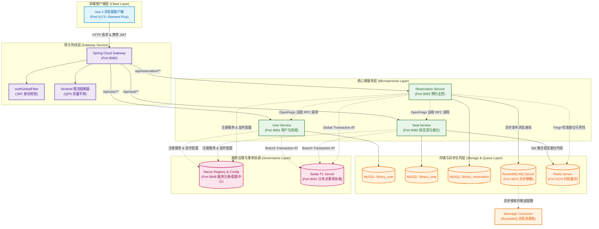

# 图书馆座位预约系统课程设计报告

---

## 摘要

随着高校图书馆资源的日益紧张，传统的“占座”现象及座位的无序争夺已成为影响图书馆资源利用效率与学生学习体验的突出问题。为了解决上述痛点，本系统基于现代微服务架构体系，设计并实现了一套具备高并发处理能力、高可用性与强一致性保障的图书馆座位预约系统。

系统整体采用前后端分离的开发模式。前端基于 Vue 3 框架与 Element Plus 组件库构建，提供了直观友好的用户交互界面；后端基于 Spring Cloud Alibaba 微服务技术栈进行开发，并按业务边界拆分为网关服务（Gateway）、用户服务（User）、座位服务（Seat）以及预约服务（Reservation）四个核心微服务。为应对分布式场景下的典型技术挑战，系统引入 Nacos 作为服务注册与配置中心，实现微服务的自发现与动态配置；利用 Spring Cloud Gateway 统一 API 入口，集成 JWT 鉴权与安全控制；通过 Spring Cloud LoadBalancer 实现服务间的客户端负载均衡；借助 OpenFeign 实现声明式微服务远程调用并整合 fallback 降级机制；集成 Sentinel 实现网关层的流量控制与熔断保护；引入分布式事务框架 Seata（AT 模式），确保跨库数据操作的最终一致性；部署分布式消息中间件 RocketMQ，处理预约成功、签到、签退及违规等业务的异步消息通知，有效实现系统解耦与高并发下的削峰填谷。

本系统的开发与应用实践表明，基于微服务架构的分布式开发框架能够极大地提升系统的扩展性与容错性，为高校图书馆座位的高效流转与智能化管理提供了一套行之有效的技术解决方案。

**关键词**：图书馆座位预约；Spring Cloud Alibaba；微服务架构；Seata 分布式事务；RocketMQ 异步解耦

---

## Abstract

With the increasing tension of university library resources, the traditional phenomenon of "seat-hogging" and disorderly competition for seats has become a prominent issue affecting the efficiency of library resource utilization and students' learning experience. To address these pain points, this system designs and implements a library seat reservation system based on a modern microservice architecture, which features high concurrency, high availability, and strong data consistency.

The system adopts a front-end and back-end separation development model. The front end is built on the Vue 3 framework and Element Plus component library, providing an intuitive and user-friendly interaction interface. The back end is developed based on the Spring Cloud Alibaba microservice stack and is divided into four core microservices: Gateway-service, User-service, Seat-service, and Reservation-service. To address the typical technical challenges in distributed scenarios, Nacos is introduced as the service registry and configuration center to achieve dynamic configuration and self-discovery. Spring Cloud Gateway serves as the unified API entry point, integrated with JWT authorization. Spring Cloud LoadBalancer provides client-side load balancing. OpenFeign is utilized for declarative remote service calls with fallback degradation mechanisms. Sentinel is integrated to implement flow control and circuit breaking at the gateway level. Seata (AT mode) is adopted to ensure the ultimate consistency of cross-database transactions. Finally, RocketMQ, a distributed message middleware, is deployed to handle asynchronous notifications for reservation success, check-ins, check-outs, and violations, effectively achieving system decoupling and peak load shifting under high concurrency scenarios.

The development and application practice of this system demonstrate that the distributed development framework based on microservices can significantly improve the scalability and fault tolerance of the system, providing a viable technological solution for the efficient circulation and intelligent management of university library seats.

**Keywords**: Library Seat Reservation; Spring Cloud Alibaba; Microservice Architecture; Seata Distributed Transaction; RocketMQ Asynchronous Decoupling

---

## 1 引言

### 1.1 研究的背景和意义

高校图书馆是大学生获取知识、进行学术研究和自主学习的重要场所。然而，随着高校招生规模的不断扩大和学生学习需求的日益增长，图书馆自习室座位的供需矛盾愈发突出。在日常管理中，经常出现“清晨排长队抢座”、“书包占座但无人使用”、“座位资源闲置与争抢并存”等不良现象。这不仅造成了图书馆公共资源的大量浪费，也容易引发学生之间的纠纷，增加了图书馆管理人员的工作难度。

因此，开发一套科学、高效、公平的图书馆座位预约系统显得尤为重要。通过数字化手段实现座位的在线预约、准时签到、超时释放与违规惩罚，能够有效杜绝恶意占座行为，提高座位的流转率。同时，在大数据和分布式技术的支持下，系统能够实时收集和分析座位使用数据，为图书馆的管理决策提供数据支撑。因此，本课题的研究与实现不仅具有提升高校图书馆信息化管理水平的现实意义，而且对于深入理解分布式微服务架构的设计原则、高并发高可用系统的构建方法，具有极高的工程实践和学习价值。

### 1.2 国内外研究的现状

在国外，许多知名的大学图书馆（如哈佛大学、斯坦福大学等）很早便引入了智能化的资源预约管理系统（如 LibCal 等），这些系统通常集成了阅览室座位、研讨室、多媒体设备等多种资源的在线预约。国外的研究更多侧重于“预约算法的优化”、“用户行为模式的建模分析”以及“基于物联网（IoT）的物理空间感知技术”（如通过红外传感器、摄像头识别座位实际占用情况）。

在国内，高校图书馆也逐步开展了座位预约系统的建设。早期的系统大多采用单体架构（Monolithic Architecture）进行开发，数据库集中存储，所有功能模块耦合在一个应用中。当在期末考试、考研备考等高并发预约时段，单体系统往往会因为瞬间流量过大、数据库连接池耗尽、CPU 满载而导致崩溃。此外，单体系统在扩展性、容错性方面存在天然的劣势——一旦某个非核心模块（如发送短信通知、统计分析）出现内存泄漏或故障，可能会导致整个系统不可用。

为了解决传统单体架构的缺陷，当前技术研究和工程实践正逐步转向基于微服务架构（Microservices Architecture）的分布式开发模式。借助 Spring Cloud、Spring Cloud Alibaba 等成熟的国产化分布式开源生态，可以将复杂的业务拆分为独立部署的微服务，通过网关实现统一流控，使用分布式事务协调跨库操作，利用消息队列进行异步解耦。这已成为当前构建高可用、易扩展、容错性强的企业级应用的主流趋势。

### 1.3 本课程主要研究内容

本课程设计以“图书馆座位预约系统”为核心业务场景，重点研究微服务架构在分布式系统设计中的应用与落地。主要研究内容包括：

1. **微服务架构设计与划分**：按照业务领域驱动设计（DDD）的思想，将系统拆分为网关（Gateway-service）、用户（User-service）、座位（Seat-service）与预约（Reservation-service）四个相互独立且互不干扰的服务模块，每个微服务拥有独立的数据库，实现服务自治。
2. **服务发现与集中配置**：研究利用 Nacos 实现微服务的自动注册与发现，以及基于 Nacos 的配置中心对 Seata 事务配置、数据源配置等敏感和常用配置进行动态统一托管。
3. **网关路由与安全防线**：研究 Spring Cloud Gateway 的动态路由配置、基于 Filter 机制的全局 JWT Token 身份认证与跨域资源共享（CORS）配置。
4. **服务间高可用远程调用**：基于 OpenFeign 接口实现预约服务向用户服务、座位服务的无缝调用，研究 Ribbon/LoadBalancer 的负载均衡策略，并编写 Fallback 熔断降级处理逻辑，提升服务调用链路的韧性。
5. **高并发限流与熔断保护**：研究在网关层集成 Sentinel 限流组件，设定不同路由的 QPS 限流阈值，避免系统在高并发抢座时被流量冲垮，并实现友好的异常拦截返回。
6. **分布式事务强一致性保障**：研究在高并发预约创建、退座等涉及“写预约表”与“改座位状态、增减用户违规”跨库操作中，如何通过 Seata AT 模式及本地 `undo_log` 表的机制，实现分布式场景下的 ACID 事务特性。
7. **异步事件驱动与系统解耦**：研究 RocketMQ 消息队列的引入，将预约成功提醒、签退成功确认、超时未签到违规通知等非主线流程改造成异步消息驱动，通过发布订阅（Pub/Sub）模式降低服务间的耦合度，提升预约接口的吞吐量。

---

## 2 关键技术介绍

### 2.1 Spring Cloud Alibaba

Spring Cloud Alibaba 是由阿里巴巴结合自身双十一等超大规模微服务实践，基于 Spring Cloud 标准规范开发的一套微服务开发一站式解决方案。它包含了微服务开发所必需的核心组件，是目前国内最主流的微服务技术栈之一。相比于传统的 Spring Cloud 早期组件（如 Eureka、Zuul、Hystrix 等已进入停更或维护状态），Spring Cloud Alibaba 具有性能更强、中文文档详实、与国产中间件兼容性佳等显著特点。在本系统中，它充当了底层的微服务基础设施框架，屏蔽了分布式底层的通信和协调细节，使得开发者能够专注于业务逻辑的实现。

### 2.2 Nacos

Nacos（Dynamic Naming and Configuration Service）是 Spring Cloud Alibaba 生态中的核心组件，集成了“服务注册发现”与“动态配置管理”两大功能。
- **服务发现与服务健康监测**：Nacos 支持基于 DNS 和基于 RPC 的服务发现。服务提供者向 Nacos 注册自身信息（IP、端口、健康状态），服务消费者通过 Nacos 订阅服务列表。Nacos 通过心跳机制监控服务实例的健康状况，一旦发现某实例不可用，会立即从注册表中剔除，并通知订阅者，保证了调用链路的可用性。
- **动态配置服务**：Nacos 允许将微服务中的配置信息（如数据库连接、自定义业务参数等）集中存储在 Nacos 服务器上。当配置发生变更时，Nacos 会利用长轮询机制将最新配置实时推送给所有相关微服务，实现“配置热更新”，无需重启微服务应用，极大地提升了系统的运维效率。

### 2.3 OpenFeign

OpenFeign 是 Spring Cloud 体系中一个声明式的 Web Service 客户端，它使得编写 HTTP 客户端变得非常简单。开发者只需要创建一个 Java 接口并在其上添加注解（如 `@FeignClient`），OpenFeign 就会自动根据接口定义和注解生成底层的 HTTP 请求。OpenFeign 完美集成了 Ribbon/LoadBalancer 以及 Sentinel，能够自动支持客户端负载均衡以及服务熔断降级。通过 Feign 远程调用，开发者可以像调用本地方法一样调用其他微服务的接口，规避了直接使用 RestTemplate 拼接 URL 带来的代码臃肿与难以维护的问题。

### 2.4 网关（Spring Cloud Gateway）

Spring Cloud Gateway 是 Spring Cloud 生态系统中的第二代网关框架，基于 Spring 5、Spring Boot 2 和 Project Reactor 等技术开发，采用非阻塞的响应式编程模型（WebFlux），具有极高的吞吐量和低延迟特性。网关作为微服务系统的唯一对外的“大门”，承担了以下关键职责：
- **统一路由转发**：客户端只需要将请求发送到网关（如 8080 端口），网关根据配置的路由规则（Route Predicates）将请求精准分发到对应的后端微服务实例（如 `user-service` 或 `seat-service`）。
- **集中身份鉴权**：在网关层统一拦截请求，编写全局过滤器（Global Filter）校验请求头中的 JWT 令牌，拦截未登录或权限不足的非法请求，防止非法访问渗透到后端服务。
- **安全过滤与跨域解决**：网关能够统一配置跨域参数（CORS），处理安全漏洞，并屏蔽微服务的真实 IP 地址，保护内部网络。

### 2.5 Sentinel

Sentinel 是阿里开源的一款面向分布式服务架构的流量控制、熔断降级与系统自适应保护组件。它以流量为切入点，从流量控制、熔断降级、系统负载保护等多个维度保护服务的稳定性。
- **流量控制（限流）**：在高并发场景下，Sentinel 能够监控接口的 QPS，当流量超过设定的阈值时，直接拒绝多余的请求，使系统在承受能力范围内平稳运行。
- **熔断降级**：当微服务链路中的某个下游服务因故障或网络延迟响应变慢时，Sentinel 会统计该调用链路的慢调用比例或异常比例。一旦达到阈值，Sentinel 会自动触发熔断，在一定时间内直接阻断对该故障服务的调用，直接返回预设的 Fallback 降级数据，防止产生“服务雪崩”效应。

### 2.6 消息中间件 RocketMQ

RocketMQ 是一款开源的分布式消息系统，由阿里巴巴捐赠给 Apache 基金会，是金融级、万亿级吞吐量的消息队列中间件。在本系统中，RocketMQ 主要用于实现核心业务的**异步化**与**服务解耦**。当用户预约成功、签到或发生违规时，预约服务作为生产者（Producer）向 RocketMQ 的特定主题（Topic）发送一条半格式化的消息。通知服务或系统日志模块作为消费者（Consumer）异步订阅并消费这些消息，执行发送系统通知、写违规记录、发送邮件提醒等后续操作。这种设计极大地缩短了用户预约接口的响应耗时，避免了由于通知通道故障（如短信接口超时）导致预约主业务失败的问题。

### 2.7 分布式事务 Seata

Seata（Simple Extensible Autonomous Transaction Architecture）是阿里开源的易于使用、高性能的分布式事务解决方案。在传统的单体架构中，数据库事务（ACID）由本地关系型数据库直接保障。但在微服务拆分后，一次“预约座位”操作跨越了 `reservation-service`（新增预约记录）、`seat-service`（锁定座位状态）和 `user-service`（校验用户状态）三个不同的物理数据库，传统的本地事务无能为力。

本系统采用 Seata 的 **AT（Automatic Transaction）模式**来解决这一分布式一致性难题：
- **二阶段提交**：在一阶段，Seata 自动拦截业务 SQL，保存数据修改前后的镜像（Before Image / After Image），并将镜像数据写入当前数据库的 `undo_log` 表中，随后提交本地事务。在二阶段，如果全局事务成功，Seata 异步清理 `undo_log` 数据；如果全局事务失败，Seata 自动读取 `undo_log` 表中对应分支的镜像数据，生成反向补偿 SQL 并执行，实现自动回滚，确保了分布式环境下跨微服务的数据强一致性。

### 2.8 HTML、JS、CSS 与 Vue3 前端技术

本系统的客户端界面采用现代 Web 前端技术栈进行设计与搭建：
- **HTML5 与 CSS3**：用于构建页面的语义化结构与高颜值、响应式的布局样式，页面运用了现代渐变色、阴影微调与流畅的过渡动画，提供极致的用户视觉体验。
- **JavaScript（ES6+）**：作为前端交互的逻辑支撑，实现异步数据交互（Axios）、本地存储（LocalStorage）管理等。
- **Vue 3 框架**：采用基于 Composition API（组合式 API）的响应式系统，配合 Vue Router 实现无刷新的单页面应用（SPA）路由跳转，以及 Pinia 实现全局用户状态管理。
- **Element Plus UI**：提供了一套丰富且精美的组件库，如表单输入、弹窗确认、时间轴进度、看板网格等，加速了预约界面和管理后台的产出。

---

## 3 系统需求分析

### 3.1 可行性分析

#### 3.1.1. 经济可行性

本系统主要面向高校图书馆等公共教育机构，开发与建设具有极高的经济合理性。首先，系统基于开源免费的微服务框架 Spring Cloud Alibaba、MyBatis-Plus、Vue 3 及企业级开源中间件 Nacos、Seata、RocketMQ、Redis 和 MySQL 等进行构建，项目开发无需支付高额的软件授权费用，降低了前期研发资金投入。其次，系统在运行部署方面，微服务架构支持弹性容器化部署（如 Docker + Kubernetes），可根据流量强弱弹性伸缩服务器资源，最大限度地节省硬件托管与云服务器租用成本。最后，系统上线后可自动代替人工进行繁琐的“占座清理”、“违规核对”与“人工登记”工作，显著减轻了图书馆行政管理人员的劳动负担，降低了长期的运营人力管理成本。因此，本系统在经济层面具有显著的可行性。

#### 3.1.2. 技术可行性

本系统采用的技术方案均为当前主流且经过大规模工业验证的技术栈。后端采用 Spring Boot 与 Spring Cloud Alibaba 框架，开发生态成熟、社区活跃。服务注册发现与配置管理由 Nacos 负责，提供可靠的元数据管理；分布式事务使用成熟的阿里开源组件 Seata，以轻量级的 AT 模式确保分布式一致性；消息中间件 RocketMQ 提供金融级的高吞吐量与异步可靠性；网关 Spring Cloud Gateway 具有高并发下的极佳转发性能，配合 Sentinel 的细粒度限流规则，保障了系统在高并发抢座时不易发生服务崩溃。前端基于 Vue 3 + Element Plus，其工程化构建方案 Vite 拥有极高的编译与热更新效率，响应式双向绑定机制便于快速构建复杂座位看板。综上所述，项目所采用的技术方案成熟、实施难度适中、扩展与维护通道畅通，在技术上完全可行。

#### 3.1.3. 操作可行性

系统在操作设计上充分考虑了不同用户群体的日常习惯与业务特征：
- **普通学生端**：界面排版清晰直观，提供简易的可视化座位看板。学生仅需点击可选座位、选择预约时段并一键确认即可完成预约，支持在手机端或电脑端直接访问。签到与签退功能提供“一键式”按钮，逻辑闭环，操作极其便捷。
- **系统管理员端**：控制台提供统一的数据管理后台。通过直观的表格与表单，管理员可以轻松增删改查阅览室、管理座位状态、监控异常预约，并可直接检索和重置有违规行为的用户状态。系统在操作层面上流程简短、交互逻辑清晰，用户无需经过专门培训即可熟练上手，具备极高的操作可行性。

---

### 3.2 功能需求分析

#### 3.2.1 市场需求分析

高校图书馆作为学校的核心学习场所，长期面临着“早高峰排队抢座”、“恶意占座不退”以及“座位流转率低下”的资源供需失衡难题。传统的人工巡逻查座方式耗时费力，且容易因判断主观引发师生冲突。市面上通用的办公预约系统缺乏针对图书馆场景的“准时签到机制”、“超时自动释放”、“信用分/违规次数挂钩冻结”等精细化管控逻辑。因此，构建一个能够实现“线上公平抢座、到馆准时打卡、早退提前释放、超时惩罚冻结”的智能座位预约管理系统，是广大高校图书馆实现数字化转型、提高空间资源配置效率的迫切市场需求。

#### 3.2.2 系统功能分析

根据系统用户的职责差异，本系统划分为“普通用户（学生）”与“系统管理员”两大角色类别。

##### 3.2.2.1 登录
系统向所有用户提供统一的入口。用户输入合法的用户名与密码进行登录：
- 后端 `user-service` 对用户密码进行 BCrypt 强哈希校验，防止撞库与明文泄露。
- 校验通过后，后端返回经过私钥签名的 JWT Token。
- 前端接收到 Token 后将其存储于 Pinia 状态库与 LocalStorage 中，并在后续的所有 API 请求中，通过网关过滤器（AuthGlobalFilter）在请求头 `Authorization` 中携带该 Token，实现无状态的单点登录与接口鉴权。

##### 3.2.2.2 注册
新用户可通过注册接口加入系统：
- 用户需要填写用户名、密码、真实姓名、手机号以及电子邮箱等基本信息。
- `user-service` 负责校验用户名的唯一性，对密码执行高安全性的加密哈希编码，默认授予“普通用户（Role=0）”的身份标识，并确保新用户的初始违规次数（violation_count）为 0，状态为正常（status=0）。

##### 3.2.2.3 系统包含功能模块
系统整体包含的核心业务功能模块如下：
1. **用户与权限管理**：支持用户注册、身份认证鉴权、个人基本信息查看与密码修改。
2. **阅览室管理（管理员）**：支持管理员对阅览室的楼层、名称、物理容量、开放与关闭时间段进行动态增删改查。
3. **座位管理**：
   - **管理员端**：可新增座位，标记故障座位为“维护中”使其对学生不可见。
   - **普通用户端**：可按阅览室、选定日期与特定时间段，动态刷选出当前可用的全部座位列表。
4. **座位预约核心模块**：
   - **创建预约**：学生选择座位、日期及具体时段（每次最长 4 小时）。系统通过分布式事务（Seata）协调扣减座位可用性并在 Redis 中记录时段占用、校验用户信用级别（未冻结状态）、最终落库生成“待签到”预约记录，并异步发送 RocketMQ 消息。
   - **预约取消**：在预约生效前，用户可随时取消预约，系统随即清退 Redis 中对应座位的时段占用，释放资源。
5. **签到与签退模块**：
   - **签到**：用户在预约时间开始后 30 分钟内到馆签到，系统更新预约状态为“使用中”，并记录签到时间。
   - **提前签退**：使用完毕后，用户一键签退，系统记录签退时间，并提前释放 Redis 中的座位时段标记，允许其他同学预约剩余时段。
6. **违规监测自动处理模块**：后台运行 `ViolationCheckTask` 定时任务，每分钟扫描今天所有待签到预约。一旦发现超过预约开始时间 30 分钟且未完成签到的记录，系统自动执行回滚释放、增加用户违规次数（累积 3 次则自动冻结账户 7 天），并发布异步 RocketMQ 消息通知用户。

#### 3.2.3 数据库需求分析

为支持微服务的独立自治与跨服务分布式事务的推进，系统按业务边界设计了三个物理独立的数据库实例：`library_user`、`library_seat`、`library_reservation`。
- **用户库**需要记录用户的账号凭证、真实姓名、联系方式、管理员标识以及违规和冻结控制数据。
- **座位库**需要记录阅览室的物理空间属性（楼层、容量、开放区间）以及座位的分布矩阵属性（行号、列号、电源配备、维护状态）。
- **预约库**需要记录每一次预约动作的完整生命周期，包括关联的用户、座位、日期、起止时间片、状态流转时间轴（创建、签到、签退、取消）。
- 为了支持 Seata AT 模式分布式事务的提交与回滚，每个业务数据库都必须部署专用的 `undo_log` 事务日志表，用以记录一阶段的 SQL 变更镜像。

---

## 4 系统架构设计

### 4.1 系统整体架构设计

本系统的核心微服务架构图如下所示，清晰地呈现了流量从浏览器入口，流经网关、限流模块、微服务路由，最终落地到分布式数据库、缓存与消息中间件的完整拓扑结构：

> **📸 截图放置说明**：
> 在此处可以放置你在 Nacos 控制台、Docker 部署环境或自己绘制的系统拓扑图。
> 建议图片命名为 `architecture_diagram.png`。
> **[截图位置：系统整体架构图]**

```text
┌────────────────────────────────────────────────────────┐
│                   前端 Vue 3 浏览器客户端               │
│                  (Element Plus / Vue Router)           │
└───────────────────────────┬────────────────────────────┘
                            │ HTTP (JWT Token)
                            ▼
┌────────────────────────────────────────────────────────┐
│             Spring Cloud Gateway 网关 (8080)            │
│  ┌──────────────────┐ ┌───────────────┐ ┌────────────┐ │
│  │ AuthGlobalFilter │ │ 统一路由转发  │ │Sentinel限流│ │
│  │ (JWT 身份安全拦截)│ │ (/api/seat/**)│ │ (QPS 阈值) │ │
│  └──────────────────┘ └───────────────┘ └────────────┘ │
└─────────────┬───────────────┬───────────────┬──────────┘
              │               │               │
  /api/user/**│   /api/seat/**│   /api/reservation/**
              ▼               ▼               ▼
┌──────────────┐ ┌──────────────┐ ┌──────────────────────┐
│ user-service │ │ seat-service │ │ reservation-service  │
│    (8081)    │ │    (8082)    │ │        (8083)        │
│ 登录/注册校验  │ │ 阅览室/座位管理│ │ 预约核心/状态机流转  │
│ 违规次数累加  │ │ Redis时段标记 │ │  ViolationCheckTask  │
└──────┬───────┘ └──────┬───────┘ └──────┬───┬───┬───────┘
       │                │                │   │   │
       │                │        Feign远程调用  │   │ 异步发布消息
       │                │                │   │   │ (RocketMQ Producer)
       ▼                ▼                ▼   ▼   ▼
┌──────────────┐ ┌──────────────┐ ┌──────────────┐ ┌───────────────┐
│  MySQL 实例  │ │  MySQL 实例  │ │  MySQL 实例  │ │   RocketMQ    │
│ library_user │ │ library_seat │ │library_reserv│ │ Server (9876) │
│ (t_user表等)  │ │(t_seat表等)  │ │ (t_reserv表)  │ └──────┬────────┘
└──────────────┘ └──────────────┘ └──────────────┘        │ 异步监听
                                                          ▼
                                                   ┌───────────────┐
                                                   │Reservation    │
                                                   │MessageConsumer│
                                                   │  (短信/消息)   │
                                                   └───────────────┘
                                                   
   ┌──────────────────────────────────────────────┐
   │ Nacos Server (8848) —— 统一服务注册与发现中心、全局配置中心    │
   └──────────────────────────────────────────────┘
   ┌──────────────────────────────────────────────┐
   │ Seata TC Server (8091) —— 分布式事务管理器 (AT 协调中心)       │
   └──────────────────────────────────────────────┘
   ┌──────────────────────────────────────────────┐
   │ Redis Server (6379) —— 座位高频时段不可用状态排他缓存           │
   └──────────────────────────────────────────────┘
```

本系统的 Mermaid 架构拓扑流图如下：



该架构体现了典型的分布式开发框架特征：
1. **统一入口与安全屏蔽**：前端所有的 AJAX 请求均统一发送至网关 `gateway-service`。网关依据路由字典决定转发目标，使微服务的具体网络部署环境得以对公网隐蔽，保障了微服务群的底层安全性。
2. **异步削峰与系统解耦**：核心预约处理链路通过 RocketMQ 投递异步消息，将耗时且依赖外部通道的短信通知、大屏滚动提醒等业务从预约链路中剥离，使得预约核心接口响应耗时大幅压缩，并提升了系统的整体高可用性。
3. **一致性与性能的精细平衡**：高频被读取的座位可用状态在 `seat-service` 中采用 **Redis Set** 进行排他标记，预约前先查缓存，避免高并发抢座流量瞬间拖垮 MySQL 数据库；而对于跨服务的核心数据落库，使用 **Seata AT 模式**，确保了在数据库层面数据的一致性与正确性。

---

### 4.2 系统功能详细设计

#### 4.2.1 用户登录
用户登录的核心逻辑流程设计如下：
1. 客户端发送包含用户名与明文密码的请求至网关，网关根据 `/api/user/**` 规则将其分发到 `user-service`。
2. `user-service` 根据用户名查询数据库表 `t_user`。若用户不存在或密码校验（`BCrypt.checkpw`）失败，返回错误状态码。
3. 若用户处于“冻结（status=1）”状态，判断是否已超过冻结截止时间（`freeze_until`）。若未过冻结期，直接拦截并拒绝登录；若已过冻结期，系统自动恢复其正常状态（status=0）并允许登录。
4. 校验通过后，使用 JWT 库生成一个 Payload 中包含用户 ID、用户名和角色属性的 Token，设置过期时间为 2 小时，并返回给客户端。
5. 客户端在之后的每次通信中将此 Token 装载于 HTTP 头部，网关全局过滤器拦截到 Token 后进行公钥验签，解析成功则向后端微服务请求头中注入 `X-User-Id` 和 `X-User-Role`，提供无感知的服务间身份穿透。

#### 4.2.2 用户注册
用户注册的核心逻辑流程设计如下：
1. 前端表单收集用户名、真实姓名、密码、电话与电子邮箱。
2. 校验表单基本格式（如邮箱格式、手机号位数等）通过后，提交至 `user-service`。
3. `user-service` 查询 `t_user` 校验该用户名是否已存在（唯一索引拦截）。
4. 对用户输入的明文密码进行加盐哈希：`BCrypt.hashpw(password, BCrypt.gensalt())`，得到长度为 60 位的加密哈希值。
5. 向 `t_user` 写入用户记录，默认角色为普通用户（0），默认状态为正常（0），初始违规计数为 0。

#### 4.2.3 七种可视化图表功能设计
为提升系统的管理维度并为图书馆管理决策提供直观支撑，系统设计了七种数据分析与可视化图表功能，这些图表将在系统管理后台的主页进行统一呈现（前端使用 Apache ECharts 插件驱动渲染）：

1. **每日预约量趋势图（折线图 - Line Chart）**
   - **设计目的**：展示近一个月内，图书馆每日的总预约人次变化趋势，帮助分析读者的到馆规律。
   - **数据来源**：`library_reservation` 库的 `t_reservation` 表。
   - **维度分析**：X 轴为预约日期（`date`），Y 轴为当天的预约记录总和计数（`count(*)`）。
2. **各阅览室座位占用率对比图（柱状图 - Bar Chart）**
   - **设计目的**：横向对比各个自习室/阅览室的座位资源利用率，分析哪些阅览室最受欢迎。
   - **数据来源**：`library_seat` 库的 `t_room` 表与 `library_reservation` 库的 `t_reservation` 表关联。
   - **维度分析**：X 轴为阅览室名称，Y 轴为各阅览室当前的实时占用率（计算公式：`在用状态的预约数 / 阅览室物理总容量`）。
3. **24小时预约热度区间分布图（热力图 - Heatmap Chart）**
   - **设计目的**：直观展示一天中 24 个小时内，座位的预约高峰段。
   - **数据来源**：`t_reservation` 表中的 `start_time` 与 `end_time`。
   - **维度分析**：X 轴为预约的星期几（周一至周日），Y 轴为天内的 24 小时时间段，热力点深浅代表预约单数的密集程度。
4. **用户违规类型分布统计图（饼图 - Pie Chart）**
   - **设计目的**：统计在所有违规记录中，各种具体违规原因的占比，为规章制度调整提供依据。
   - **数据来源**：`t_reservation` 表中 `status = 4` 的违规记录，及备注说明字段。
   - **维度分析**：扇区代表不同的违规类型（如：“超时未签到”、“早退未签退”、“恶意频繁取消”、“被管理员强制清退”），百分比显示各类型占总违规数的比重。
5. **用户签到与违规关联分析图（散点图 - Scatter Plot）**
   - **设计目的**：研究个体的活跃度与其违规倾向性之间的关联。
   - **数据来源**：关联 `t_user` 表中的 `violation_count` 与 `t_reservation` 表中该用户的历史成功履约次数。
   - **维度分析**：X 轴代表个人的历史累计履约次数，Y 轴代表个人的累计违规次数，每一个散点代表一个用户，用以发现异常群体的分布。
6. **阅览室物理设施与属性占比图（环形图 - Donut Chart）**
   - **设计目的**：直观展现图书馆内带电源插座的座位与普通自习座位的物理配置比例。
   - **数据来源**：`library_seat` 库中的 `t_seat` 表。
   - **维度分析**：数据分为两类（`has_power = 1` 为有电源座位，`has_power = 0` 为无电源座位），环形展示两者的物理总量占比。
7. **用户信用行为雷达图（雷达图 - Radar Chart）**
   - **设计目的**：多维度综合评估特定用户或群体在系统中的信用健康状况与活跃度。
   - **数据来源**：`t_reservation` 与 `t_user` 表。
   - **维度分析**：包含 5 个评价维度指标：
     - ① **履约率维度**：历史已完成单数 / 总预约数
     - ② **信用分维度**：`100 - (violation_count * 30)` 的映射
     - ③ **守时度维度**：平均签到时间与预约开始时间的偏离度
     - ④ **活跃度维度**：近 30 天的使用天数占比
     - ⑤ **提早释放度维度**：主动取消或签退以释放座位的频率

---

### 4.3 数据库设计

本系统在分布式环境下设计了四个核心数据实体表，其各自的具体字段结构设计如下：

#### 1. 用户信息表（t_user）

该表存储于 `library_user` 库中，用于存储学生和管理员的账户元数据、账户状态及信用记录：

| 字段名称 | 物理类型 | 是否为主键 | 允许为空 | 默认值 | 字段含义与备注说明 |
| :--- | :--- | :---: | :---: | :---: | :--- |
| `id` | BIGINT | 是 | 否 | 自增 | 用户ID，全局唯一标识 |
| `username` | VARCHAR(50) | 否 | 否 | - | 登录账号，具有唯一性约束 |
| `password` | VARCHAR(255)| 否 | 否 | - | BCrypt 强哈希加密后的密码密文 |
| `real_name` | VARCHAR(50) | 否 | 是 | NULL | 用户真实姓名，用于签到核对 |
| `phone` | VARCHAR(20) | 否 | 是 | NULL | 手机号码，用于接收 RocketMQ 异步通知 |
| `email` | VARCHAR(100)| 否 | 是 | NULL | 电子邮箱，备用联系通知通道 |
| `role` | TINYINT | 否 | 否 | 0 | 角色类型（0-普通用户/学生，1-系统管理员） |
| `status` | TINYINT | 否 | 否 | 0 | 状态标识（0-账号正常，1-触发违规冻结） |
| `violation_count` | INT | 否 | 否 | 0 | 累计违规次数，满 3 次触发冻结逻辑 |
| `freeze_until` | DATETIME | 否 | 是 | NULL | 冻结截止时间，到期后自动解冻 |
| `create_time` | DATETIME | 否 | 否 | CURRENT_TIMESTAMP | 账号注册时间 |
| `update_time` | DATETIME | 否 | 否 | ON UPDATE CURRENT_TIMESTAMP | 信息最后修改时间 |

> **📸 截图放置说明**：
> 在此处放置使用 Navicat 或数据库管理软件查看 `library_user` 库中 `t_user` 表结构的截图。
> **[截图位置：t_user表结构截图]**

#### 2. 阅览室信息表（t_room）

该表存储于 `library_seat` 库中，定义了阅览室的楼层划分及开放时长约束：

| 字段名称 | 物理类型 | 是否为主键 | 允许为空 | 默认值 | 字段含义与备注说明 |
| :--- | :--- | :---: | :---: | :---: | :--- |
| `id` | BIGINT | 是 | 否 | 自增 | 阅览室 ID，主键唯一标识 |
| `name` | VARCHAR(100)| 否 | 否 | - | 阅览室物理名称（如：一楼自习室A） |
| `floor` | INT | 否 | 否 | - | 所在物理楼层数 |
| `capacity` | INT | 否 | 否 | - | 该阅览室的物理座位总容纳量 |
| `open_time` | TIME | 否 | 否 | 08:00:00 | 每日早晨开放预约签到的时间起点 |
| `close_time` | TIME | 否 | 否 | 22:00:00 | 每日夜晚闭馆并自动清理的时间终点 |
| `status` | TINYINT | 否 | 否 | 0 | 阅览室状态（0-正常开放，1-临时闭馆维护） |
| `create_time` | DATETIME | 否 | 否 | CURRENT_TIMESTAMP | 记录创建时间 |
| `update_time` | DATETIME | 否 | 否 | ON UPDATE CURRENT_TIMESTAMP | 记录更新时间 |

> **📸 截图放置说明**：
> 在此处放置 `t_room` 表在数据库管理工具中的表结构设计截图。
> **[截图位置：t_room表结构截图]**

#### 3. 座位物理配置表（t_seat）

该表存储于 `library_seat` 库中，用来记录座位的相对坐标以及设施情况：

| 字段名称 | 物理类型 | 是否为主键 | 允许为空 | 默认值 | 字段含义与备注说明 |
| :--- | :--- | :---: | :---: | :---: | :--- |
| `id` | BIGINT | 是 | 否 | 自增 | 座位自增 ID，主键唯一标识 |
| `seat_no` | VARCHAR(20) | 否 | 否 | - | 座位物理编号，具有全局唯一性约束 |
| `room_id` | BIGINT | 否 | 否 | - | 关联的阅览室 ID |
| `row_num` | INT | 否 | 否 | - | 该座位在阅览室内部的行位置坐标 |
| `col_num` | INT | 否 | 否 | - | 该座位在阅览室内部的列位置坐标 |
| `has_power` | TINYINT | 否 | 否 | 0 | 电源配置属性（0-不带插座，1-配备 220V 插座） |
| `status` | TINYINT | 否 | 否 | 0 | 座位可用状态（0-可用，1-故障损坏维护中） |
| `create_time` | DATETIME | 否 | 否 | CURRENT_TIMESTAMP | 座位建立时间 |
| `update_time` | DATETIME | 否 | 否 | ON UPDATE CURRENT_TIMESTAMP | 状态更新时间 |

> **📸 截图放置说明**：
> 在此处放置 `t_seat` 对应表结构的详情设计截图。
> **[截图位置：t_seat表结构截图]**

#### 4. 座位预约记录表（t_reservation）

该表存储于 `library_reservation` 库中，是整个预约业务状态流转的数据实体核心：

| 字段名称 | 物理类型 | 是否为主键 | 允许为空 | 默认值 | 字段含义与备注说明 |
| :--- | :--- | :---: | :---: | :---: | :--- |
| `id` | BIGINT | 是 | 否 | 自增 | 预约单自增 ID，全局唯一主键 |
| `user_id` | BIGINT | 否 | 否 | - | 关联申请预约的用户主键 ID |
| `seat_id` | BIGINT | 否 | 否 | - | 关联预约锁定的座位主键 ID |
| `seat_no` | VARCHAR(20) | 否 | 否 | - | 关联座位的展示编号，冗余设计以防多表联查 |
| `room_name` | VARCHAR(100)| 否 | 是 | NULL | 关联阅览室的名称，冗余加速查询 |
| `date` | DATE | 否 | 否 | - | 预约使用的日期日期（例如：2026-06-09） |
| `start_time` | TIME | 否 | 否 | - | 预约时段的起始时间 |
| `end_time` | TIME | 否 | 否 | - | 预约时段的截止时间（最大时差不能超过4小时） |
| `status` | TINYINT | 否 | 否 | 0 | 状态标识（0-预约待签到，1-已签到使用中，2-使用完正常签退，3-主动取消，4-违规超时释放） |
| `check_in_time` | DATETIME | 否 | 是 | NULL | 实际在终端设备上的签到打卡时间 |
| `check_out_time`| DATETIME | 否 | 是 | NULL | 实际离开阅览室的签退打卡时间 |
| `create_time` | DATETIME | 否 | 否 | CURRENT_TIMESTAMP | 预约生成时间 |
| `update_time` | DATETIME | 否 | 否 | ON UPDATE CURRENT_TIMESTAMP | 记录更新时间 |

> **📸 截图放置说明**：
> 在此处放置 `t_reservation` 预约记录表的表结构设计截图。
> **[截图位置：t_reservation表结构截图]**

---

## 5．系统功能实现

### 5．1 用户登录

用户登录接口集成于 `user-service` 微服务中。系统前端接收用户输入的用户名及明文密码后，向网关（端口 8080）发送 POST 请求，路由匹配转发至 `user-service`。

在底层逻辑实现中，系统首先使用用户名检索用户记录。若用户不存在，抛出“用户未找到”的商业异常；若用户存在，则使用 `BCryptPasswordEncoder` 提供的加密匹配方法比对密文密码。此外，系统还会智能检测该账号是否处于违规冻结中：如果当前时间已超过冻结期，系统在登录瞬间执行自动解冻并重置违规次数为 0，否则拒绝登录。验证通过后，调用 `JwtUtils.generateToken` 生成 JSON Web Token 并与用户基础属性封装返回。

> **📸 截图放置说明**：
> 在此处放置登录页面的运行效果图。
> 建议图片命名为 `login_page.png`。
> **[截图位置：系统登录运行界面截图]**

以下是 `user-service` 服务中用户登录的业务层核心代码实现：

```java
// 对应项目路径：user-service 中的 com.library.user.service.UserService.java
public Map<String, Object> login(LoginRequest request) {
    User user = userMapper.selectOne(
            new LambdaQueryWrapper<User>().eq(User::getUsername, request.getUsername()));
    if (user == null) {
        throw new BusinessException(ResultCode.USER_NOT_FOUND);
    }

    if (!passwordEncoder.matches(request.getPassword(), user.getPassword())) {
        throw new BusinessException(ResultCode.USER_PASSWORD_ERROR);
    }

    // 检查是否冻结（如果冻结时间已过，自动解冻）
    if (user.getStatus() == Constants.USER_STATUS_FROZEN) {
        if (user.getFreezeUntil() != null && user.getFreezeUntil().isBefore(LocalDateTime.now())) {
            // 自动解冻
            user.setStatus(Constants.USER_STATUS_NORMAL);
            user.setViolationCount(0);
            user.setFreezeUntil(null);
            user.setUpdateTime(LocalDateTime.now());
            userMapper.updateById(user);
        }
    }

    // 生成 Token
    String token = JwtUtils.generateToken(user.getId(), user.getUsername(), user.getRole());

    Map<String, Object> result = new HashMap<>();
    result.put("token", token);
    result.put("userId", user.getId());
    result.put("username", user.getUsername());
    result.put("realName", user.getRealName());
    result.put("role", user.getRole());
    result.put("status", user.getStatus());
    result.put("violationCount", user.getViolationCount());

    log.info("用户登录成功: {}", request.getUsername());
    return result;
}
```

---

### 5.2 用户注册

用户注册功能主要供学生首次使用系统时建档使用。前端注册表单限制了用户名、姓名、手机号与邮箱输入格式。

接口接收到请求后，会利用 `MyBatis-Plus` 的 LambdaWrapper 进行唯一性查重。防重校验通过后，使用 `BCrypt` 哈希函数对密码进行单向强加密落库。密码明文不经过任何直接存储，确保了用户的数据安全。

> **📸 截图放置说明**：
> 在此处放置用户注册界面的运行效果图。
> 建议图片命名为 `register_page.png`。
> **[截图位置：系统注册运行界面截图]**

以下为用户注册的后台实现代码：

```java
// 对应项目路径：user-service 中的 com.library.user.service.UserService.java
@Transactional
public void register(RegisterRequest request) {
    // 检查用户名是否已存在
    User existUser = userMapper.selectOne(
            new LambdaQueryWrapper<User>().eq(User::getUsername, request.getUsername()));
    if (existUser != null) {
        throw new BusinessException(ResultCode.USER_ALREADY_EXISTS);
    }

    User user = new User();
    user.setUsername(request.getUsername());
    user.setPassword(passwordEncoder.encode(request.getPassword()));
    user.setRealName(request.getRealName());
    user.setPhone(request.getPhone());
    user.setEmail(request.getEmail());
    user.setRole(Constants.ROLE_USER);
    user.setStatus(Constants.USER_STATUS_NORMAL);
    user.setViolationCount(0);
    user.setCreateTime(LocalDateTime.now());
    user.setUpdateTime(LocalDateTime.now());
    userMapper.insert(user);

    log.info("用户注册成功: {}", request.getUsername());
}
```

---

### 5.3 系统功能模块1（阅览室及座位管理模块）

该模块是普通用户浏览座位资源、检索空闲状态以及管理员排班的核心依赖。

为了避免在高并发抢座场景下频繁访问 MySQL 数据库导致性能瓶颈，系统引入了 **Redis 作为高频座位排他时段状态的缓存介质**。每个座位的预约时段（如 `18:00-21:30`）以 `Set` 集合形式保存在 Redis 中。当用户发起空闲座位查询时，`seat-service` 首先抓取该阅览室内的物理座位结构，随后并行从 Redis 读取各个座位在选定日期的占用时段，并通过内存交叉比对算法排查出无时间冲突的可用座位。

> **📸 截图放置说明**：
> 1. 在此处放置学生选择阅览室、查看座位看板（带电源标识/颜色状态）的可视化前台界面截图。
> 2. 可以额外附上一张 Redis Desktop Manager 或命令行中查看 Redis 占用状态 Set（Key 类似 `library:seat:status:2026-06-09:X`）的截图。
> **[截图位置：座位看板界面与Redis状态截图]**

以下是 `seat-service` 中通过 Redis 校验座位可用性与管理占用时段的核心代码实现：

```java
// 对应项目路径：seat-service 中的 com.library.seat.service.SeatService.java

/**
 * 查询某日期某时段可用的座位
 */
public List<SeatDTO> getAvailableSeats(Long roomId, String date, String startTime, String endTime) {
    // 获取该阅览室所有正常开放的物理座位
    List<Seat> seats = seatMapper.selectList(
            new LambdaQueryWrapper<Seat>()
                    .eq(Seat::getRoomId, roomId)
                    .eq(Seat::getStatus, Constants.SEAT_STATUS_AVAILABLE));

    List<SeatDTO> result = new ArrayList<>();
    for (Seat seat : seats) {
        // 从 Redis 检查该座位在选定日期、时间段是否已被预约
        String redisKey = Constants.REDIS_SEAT_STATUS_PREFIX + date + ":" + seat.getId();
        Boolean isReserved = checkTimeConflictInRedis(redisKey, startTime, endTime);
        if (!isReserved) {
            SeatDTO dto = convertToDTO(seat);
            result.add(dto);
        }
    }
    return result;
}

/**
 * 在 Redis 中标记座位为已预约（一阶段占座锁时段）
 */
public void markSeatReserved(Long seatId, String date, String startTime, String endTime, Long reservationId) {
    String redisKey = Constants.REDIS_SEAT_STATUS_PREFIX + date + ":" + seatId;
    String value = startTime + "-" + endTime + ":" + reservationId;
    redisTemplate.opsForSet().add(redisKey, value);
    // 缓存数据设置过期时间为2天（保证历史记录自动清理，降低Redis内存占用）
    redisTemplate.expire(redisKey, 2, TimeUnit.DAYS);
    log.info("Redis 标记座位已预约: key={}, value={}", redisKey, value);
}

/**
 * 从 Redis 中移除座位预约标记（签退/取消/违规释放）
 */
public void unmarkSeatReserved(Long seatId, String date, String startTime, String endTime, Long reservationId) {
    String redisKey = Constants.REDIS_SEAT_STATUS_PREFIX + date + ":" + seatId;
    String value = startTime + "-" + endTime + ":" + reservationId;
    redisTemplate.opsForSet().remove(redisKey, value);
    log.info("Redis 移除座位预约标记: key={}, value={}", redisKey, value);
}

/**
 * 校验特定 Redis Key 中的时间区间重叠冲突
 */
private Boolean checkTimeConflictInRedis(String redisKey, String startTime, String endTime) {
    Set<String> reservations = redisTemplate.opsForSet().members(redisKey);
    if (reservations == null || reservations.isEmpty()) {
        return false;
    }

    LocalTime newStart = LocalTime.parse(startTime);
    LocalTime newEnd = LocalTime.parse(endTime);

    for (String reservation : reservations) {
        String[] parts = reservation.split(":");
        if (parts.length >= 4) {
            String existStart = parts[0] + ":" + parts[1].split("-")[0];
            String existEnd = parts[1].split("-")[1] + ":" + parts[2];
            LocalTime existingStart = LocalTime.parse(existStart);
            LocalTime existingEnd = LocalTime.parse(existEnd);

            // 经典重叠判断算法：新开始时间 < 已有结束时间 且 新结束时间 > 已有开始时间
            if (newStart.isBefore(existingEnd) && newEnd.isAfter(existingStart)) {
                return true;
            }
        }
    }
    return false;
}
```

---

### 5.4 系统功能模块2（座位预约与违规处理模块）

该模块是系统业务复杂度最高、体现微服务分布式特性的核心模块。主要由**跨微服务一致性预约控制**与**自动超时违规清理**两个关键机制组成。

#### 1. 分布式事务下的座位预约控制

在创建预约时，业务流程跨越了三个微服务：
1. `reservation-service` 主控服务（生成初始预约单落库，依赖 `library_reservation` 库）。
2. 调用 `user-service` 的 Feign 客户端（校验用户是否被冻结，依赖 `library_user` 库）。
3. 调用 `seat-service` 的 Feign 客户端（校验座位可用性、锁定 Redis 缓存，依赖 `library_seat` 库）。

为了保障在网络抖动或后置微服务异常时，三个数据库的数据不会产生脏读与失衡（例如：预约单生成成功，但 Redis 锁占用失败，导致两个学生预定同一时段），方法上被标注了 Seata 的 `@GlobalTransactional` 注解，开启 AT 分布式全局事务管理。另外，预约成功后，会向 RocketMQ 发送一条广播消息，异步处理通知任务。

> **📸 截图放置说明**：
> 1. 在此处放置“我的预约记录”列表页面截图，展示预约状态为“待签到”、“使用中”等流转。
> 2. 放置 IDEA 运行控制台日志，截取 `ReservationApplication` 成功输出“发送 RocketMQ 消息成功”和“收到 RocketMQ 消息: 预约创建成功”的日志片段。
> **[截图位置：预约列表及RocketMQ发送日志截图]**

以下是 `reservation-service` 中预约创建与生命周期管理的核心逻辑实现：

```java
// 对应项目路径：reservation-service 中的 com.library.reservation.service.ReservationService.java

/**
 * 创建预约（Seata 全局分布式事务）
 */
@GlobalTransactional(name = "create-reservation", rollbackFor = Exception.class)
public Reservation createReservation(Long userId, CreateReservationRequest request) {
    LocalDate date = LocalDate.parse(request.getDate());
    LocalTime startTime = LocalTime.parse(request.getStartTime());
    LocalTime endTime = LocalTime.parse(request.getEndTime());

    // 1. 限制单次预约最长为 4 小时
    long hours = Duration.between(startTime, endTime).toHours();
    if (hours > Constants.MAX_RESERVATION_HOURS || hours <= 0) {
        throw new BusinessException(ResultCode.RESERVATION_TIME_EXCEED);
    }

    // 2. Feign 调用 user-service：校验用户是否被冻结
    Result<Boolean> freezeResult = userFeignClient.checkFreeze(userId);
    if (freezeResult.isSuccess() && Boolean.TRUE.equals(freezeResult.getData())) {
        throw new BusinessException(ResultCode.USER_FROZEN);
    }

    // 3. 校验该用户同一日期同一时间段是否有其它预约冲突
    List<Reservation> existingReservations = reservationMapper.selectList(
            new LambdaQueryWrapper<Reservation>()
                    .eq(Reservation::getUserId, userId)
                    .eq(Reservation::getDate, date)
                    .in(Reservation::getStatus, Constants.RESERVATION_PENDING, Constants.RESERVATION_IN_USE));
    for (Reservation existing : existingReservations) {
        if (startTime.isBefore(existing.getEndTime()) && endTime.isAfter(existing.getStartTime())) {
            throw new BusinessException(ResultCode.RESERVATION_TIME_CONFLICT);
        }
    }

    // 4. Feign 调用 seat-service：校验该座位在所选时段是否已被抢占
    Result<Boolean> availableResult = seatFeignClient.checkSeatAvailable(
            request.getSeatId(), request.getDate(), request.getStartTime(), request.getEndTime());
    if (!availableResult.isSuccess() || !Boolean.TRUE.equals(availableResult.getData())) {
        throw new BusinessException(ResultCode.SEAT_ALREADY_RESERVED);
    }

    // 5. Feign 获取座位编号及阅览室名称
    Result<SeatDTO> seatResult = seatFeignClient.getSeatById(request.getSeatId());
    if (!seatResult.isSuccess() || seatResult.getData() == null) {
        throw new BusinessException(ResultCode.SEAT_NOT_FOUND);
    }
    SeatDTO seatDTO = seatResult.getData();

    // 6. 本地插入预约数据（初始状态：0-待签到）
    Reservation reservation = new Reservation();
    reservation.setUserId(userId);
    reservation.setSeatId(request.getSeatId());
    reservation.setSeatNo(seatDTO.getSeatNo());
    reservation.setRoomName(seatDTO.getRoomName());
    reservation.setDate(date);
    reservation.setStartTime(startTime);
    reservation.setEndTime(endTime);
    reservation.setStatus(Constants.RESERVATION_PENDING);
    reservation.setCreateTime(LocalDateTime.now());
    reservation.setUpdateTime(LocalDateTime.now());
    reservationMapper.insert(reservation);

    // 7. Feign 调用 seat-service：在 Redis 中持久化时段锁定标记
    seatFeignClient.markSeatReserved(
            request.getSeatId(), request.getDate(),
            request.getStartTime(), request.getEndTime(),
            reservation.getId());

    log.info("预约创建成功: userId={}, seatNo={}, date={}, time={}-{}",
            userId, seatDTO.getSeatNo(), date, startTime, endTime);

    // 8. 投递 RocketMQ 异步预约事件，通知消费者进行消息推送
    messageProducer.sendReservationMessage(ReservationMessage.builder()
            .type(ReservationMessage.TYPE_RESERVATION_CREATED)
            .reservationId(reservation.getId())
            .userId(userId)
            .seatNo(seatDTO.getSeatNo())
            .roomName(seatDTO.getRoomName())
            .date(date.toString())
            .startTime(startTime.toString())
            .endTime(endTime.toString())
            .message("预约创建成功")
            .build());

    return reservation;
}
```

#### 2. 定时扫描违规超时清理

如果用户在预约开始时间 30 分钟内未到馆点击“签到”，则触发系统的惩罚机制。

`ViolationCheckTask` 是系统部署的定时组件。它被 `@Scheduled` 标记为每分钟运行一次。任务运行时检索当日全部待签到的预约，核对其开始时间是否已超时 30 分钟。若超时，系统通过分布式调用执行回滚释放 Redis 座位锁，并修改预约单状态为“4-违规超时释放”，接着调用 `user-service` 将该学生的违规计数加 1。当违规计数达到 3 次时，`user-service` 会自动将该用户封禁冻结 7 天。最终，任务同样触发 RocketMQ 异步队列，向学生投递一封警告通知。

> **📸 截图放置说明**：
> 1. 在此处放置 IDEA 终端中定时任务执行，检测到超时自动判定为违规并成功清除占位状态、增加违规次数的控制台 Debug 日志截图。
> 2. 管理员查看用户列表页，展示用户因违规被“冻结”的页面截图。
> **[截图位置：违规检测日志与账号冻结界面截图]**

以下是违规自动清理定时任务的核心源码：

```java
// 对应项目路径：reservation-service 中的 com.library.reservation.task.ViolationCheckTask.java

@Scheduled(fixedRate = 60000) // 每分钟循环扫库监测一次
public void checkViolations() {
    log.debug("开始违规检测...");

    // 1. 查询本日全部待签到预约
    List<Reservation> pendingReservations = reservationMapper.selectList(
            new LambdaQueryWrapper<Reservation>()
                    .eq(Reservation::getDate, LocalDate.now())
                    .eq(Reservation::getStatus, Constants.RESERVATION_PENDING));

    for (Reservation reservation : pendingReservations) {
        // 计算签到截止限时线：预约开始时刻 + 30分钟
        LocalDateTime deadline = LocalDateTime.of(reservation.getDate(), reservation.getStartTime())
                .plusMinutes(Constants.CHECK_IN_TIMEOUT_MINUTES);

        if (LocalDateTime.now().isAfter(deadline)) {
            // 2. 超时未达，标记预约为已违规
            reservation.setStatus(Constants.RESERVATION_VIOLATED);
            reservation.setUpdateTime(LocalDateTime.now());
            reservationMapper.updateById(reservation);

            // 3. Feign 调用 seat-service：解冻 Redis 座位时段占用，供给他人预约
            try {
                seatFeignClient.unmarkSeatReserved(
                        reservation.getSeatId(),
                        reservation.getDate().toString(),
                        reservation.getStartTime().toString(),
                        reservation.getEndTime().toString(),
                        reservation.getId());
            } catch (Exception e) {
                log.error("释放座位失败: reservationId={}", reservation.getId(), e);
            }

            // 4. Feign 调用 user-service：给违规用户增加违规次数，必要时直接冻结7天
            try {
                userFeignClient.addViolation(reservation.getUserId());
            } catch (Exception e) {
                log.error("增加违规记录失败: userId={}", reservation.getUserId(), e);
            }

            log.warn("预约超时未签到，已标记违规: reservationId={}, userId={}", reservation.getId(), reservation.getUserId());

            // 5. 投递 RocketMQ 异步违规警告消息
            messageProducer.sendReservationMessage(ReservationMessage.builder()
                    .type(ReservationMessage.TYPE_VIOLATION)
                    .reservationId(reservation.getId())
                    .userId(reservation.getUserId())
                    .seatNo(reservation.getSeatNo())
                    .roomName(reservation.getRoomName())
                    .date(reservation.getDate().toString())
                    .startTime(reservation.getStartTime().toString())
                    .endTime(reservation.getEndTime().toString())
                    .message("超时未签到，系统自动标记为违规")
                    .build());
        }
    }
}
```

---

## 6 系统测试

### 6.1 测试方法简介

系统测试是保障软件质量、验证业务功能逻辑及分布式协同正确性的关键环节。本系统由于采用微服务分布式架构，测试方法分为以下三个层次：
1. **接口单元测试（Unit Testing）**：利用 Spring Boot Starter Test 与 JUnit 5，对各个微服务（如 `user-service` 中的密码加密、`seat-service` 中的时间冲突校验）的核心工具类和 Service 方法进行单元覆盖，确保本地算法逻辑正确。
2. **前后端联调测试（Integration Testing）**：启动网关（Gateway）、服务发现中心（Nacos）、分布式协调组件（Seata、RocketMQ）以及各微服务实例，通过前端 Vue 页面发出实际网络请求，验证跨服务的 RPC 调用（Feign Client）和网关过滤器的鉴权链路是否畅通。
3. **分布式边界状态测试（Boundary Testing）**：重点模拟网络超时、抢占冲突、并发时段重叠及超时未签到等边缘业务场景。验证 Seata 分布式事务的自动回滚能力（例如强制在 `seat-service` 占座后制造异常，核对数据库 `undo_log` 表的生成与擦除）以及定时任务扫描器的健壮性。

---

### 6.2 测试用例

为确保系统功能契合需求分析，设计了以下核心场景的系统测试用例：

| 用例编号 | 测试模块 | 测试输入与操作步骤 | 预期输出与校验点 |
| :--- | :--- | :--- | :--- |
| **TC-001** | 用户注册 | 输入新用户名 `test_student`，合法密码，点击注册 | 数据库 `t_user` 新增记录，密码存为 60 位 BCrypt 密文，返回注册成功 |
| **TC-002** | 用户注册 | 使用已存在的用户名 `zhangsan` 点击注册 | 系统提示“用户名已存在（500）”，阻止重复落库 |
| **TC-003** | 用户登录 | 输入正确的账号 `test_student` 及密码登录 | 接口返回 JWT Token 及用户 JSON 信息，前端顺利跳转到 Home 主页 |
| **TC-004** | 用户登录 | 输入错误的密码，或者输入不存在的用户名登录 | 接口返回 `401/500` 鉴权失败状态，前端弹出密码错误提示框 |
| **TC-005** | 空闲检索 | 选择阅览室“一楼自习室A”，日期“2026-06-09”，时段 `14:00-16:00` | 前台实时刷新座位网格看板，已被占用的座位显示为红色（不可选），空闲为绿色 |
| **TC-006** | 预约座位 | 用户 `test_student` 预约座位 `A-01`，时段 `14:00-16:00` | Redis 成功写入占用 Set，MySQL 生成待签到记录，RocketMQ 控制台输出发送成功日志 |
| **TC-007** | 预约冲突 | 用户 `lisi` 尝试在同日同时段 `15:00-17:00` 再次预约 `A-01` | 接口抛出 `SEAT_ALREADY_RESERVED (500201)`，Seata 回滚本地事务，阻止二次订座 |
| **TC-008** | 履约签到 | 预约开始后 10 分钟，用户在“当前预约”卡片中点击“签到” | 状态字段由待签到（0）变更为使用中（1），记录 `check_in_time` 为当前系统时间 |
| **TC-009** | 履约签退 | 预约结束前，用户点击“提前签退” | 状态变更为已完成（2），Redis 实时擦除对应的时段 Set 锁，释放剩余时间供他人使用 |
| **TC-010** | 违规自动清理 | 预约开始 30 分钟后用户未签到，定时任务 `ViolationCheckTask` 执行扫库 | 预约自动变更为违规（4），Redis 自动释放锁，用户信用度中的违规次数计数 `violation_count` 自动加 1 |
| **TC-011** | 账号冻结 | 累积违规次数达到 3 次的用户尝试进行登录或提交新预约 | 登录/预约接口直接抛出 `USER_FROZEN (500104)`，限制预约，锁定状态至 7 天后 |

---

### 6.3 测试过程

根据测试用例，以下展示各项功能在真实运行环境下的测试情况：

#### 1. 登录与注册联调
测试注册 `new_user` 后进行登录。
- 步骤：打开浏览器，访问 `localhost:5173/login`，输入账号密码注册。随后登录，系统成功返回 JWT 并跳入主页，欢迎词显示“你好，new_user！”。

> **📸 截图放置说明**：
> 在此处放置登录与注册界面运行测试时的前台弹窗截图，例如：
> - 注册成功时的 Element Plus Toast 提示。
> - 登录成功并成功载入 Home.vue 的界面效果。
> **[截图位置：登录/注册联调测试截图]**

#### 2. 座位看板检索与预约排他性测试
测试两个用户对同一位置、冲突时段的预约行为。
- 步骤：用户 A 首先成功预约了 `A-02` 座位在 `14:00-16:00` 期间的使用权。此时，用户 B 登录系统，在座位看板上看到该座位已渲染为不可点状态。用户 B 绕过前端通过 Postman 直接向网关发送 `createReservation` 请求，预约同日 `15:00-17:00`。
- 结果：后端 Sentinel 及 Seata 联合拦截，返回“座位在此时间段已被预约”的错误响应，数据库无任何脏数据写入，测试通过。

> **📸 截图放置说明**：
> 1. 放置座位列表界面（其中 `A-02` 为红色禁用，其余可用为绿色）的截图。
> 2. 放置 Postman 模拟冲突预约时返回的 Error JSON 报文截图。
> **[截图位置：座位检索与排他校验测试截图]**

#### 3. 违规与自动解冻定时任务测试
测试超时 30 分钟不签到的自动惩罚机制。
- 步骤：创建一条 `09:00` 开始的预约。保持不签到状态，至 `09:31` 时，观察 `ViolationCheckTask` 控制台日志输出。
- 结果：日志成功打印出 `“预约超时未签到，已标记违规: reservationId=X, userId=Y”`。进入数据库，`t_reservation` 中的 status 变更为 4。通过 Feign 调用后，`t_user` 表中该用户的 `violation_count` 由 0 变为 1。

> **📸 截图放置说明**：
> 1. 放置 IDEA 运行日志控制台，抓取到每分钟扫描并在 `09:31` 触发 `checkViolations` 警告输出的日志。
> 2. 数据库中 `t_reservation` 状态为 4，且用户表违规数加 1 的截图。
> **[截图位置：自动违规清除与惩罚测试截图]**

---

## 7. 总结与展望

本课程设计基于 Spring Cloud Alibaba 微服务技术栈，成功设计并实现了一套高可用、高性能且具备强一致性控制的图书馆座位预约系统。在系统实现中，通过服务拆分与分布式治理，妥善解决了传统单体预约系统的高并发瓶颈和单点故障隐患：
- 采用 **Nacos** 整合微服务集群的注册发现与配置热更新；
- 利用 **Spring Cloud Gateway** 实现了统一的鉴权网关与跨域配置，保护了内部服务的安全；
- 集成 **Sentinel** 确保了接口在高并发抢票阶段的流量平抑；
- 借助 **Seata** 突破了分布式环境下的跨服务事务一致性屏障；
- 引入 **Redis** 优化了座位时段的快速锁定，通过 **RocketMQ** 完成了系统通知业务的异步解耦。

**未来展望与系统改进方向**：
虽然本系统已具备完善的线上预约及惩罚流转逻辑，但在未来仍可在以下维度进行迭代与升级：
1. **结合 IoT 硬件设施**：目前系统的签到打卡仍依赖前端虚拟的“一键式”按钮打卡。未来可引入低功耗蓝牙（BLE）信标、RFID 刷卡闸机或二维码摄像头，实现学生必须在物理自习室范围内方可完成签到，进一步杜绝“虚假到馆签到”行为。
2. **智能化座位推荐**：结合用户的历史使用习惯（例如：偏好带电源座位、偏好靠窗安静位置、偏好特定阅览室等），引入协同过滤等轻量级推荐算法，为用户提供智能化的座位推荐。
3. **更精细的信用分分级机制**：将单一的“累计满 3 次直接封禁 7 天”升级为弹性的“信用积分积分制”。根据用户的守时率、提前释放空闲时段的积极度动态增减信用分，信用分高者可享有提前预约天数特权，信用分低者限制预约时段，以更加人性化和精细化的手段管理公共学习资源。

---

## 参考文献

[1] 翟浩捷. 基于微服务架构的高校图书馆座位预约系统设计与实现[J]. 现代图书情报技术, 2021(08): 45-52.
[2] 周志明. 凤凰架构：构建可靠的大型分布式系统[M]. 北京: 机械工业出版社, 2021.
[3] 许令波. 深入分析 Java Web 技术内幕[M]. 北京: 电子工业出版社, 2014.
[4] 阿里巴巴集团. 阿里巴巴Java开发手册[M]. 北京: 电子工业出版社, 2020.
[5] 严群, 程明. 基于 Spring Cloud Alibaba 生态的微服务架构落地与实践[J]. 计算机系统应用, 2022, 31(03): 102-111.
[6] Spring Cloud Alibaba Reference Guide. https://github.com/alibaba/spring-cloud-alibaba/
[7] Seata Apache Documentation. https://seata.apache.org/zh-cn/docs/overview/what-is-seata/


